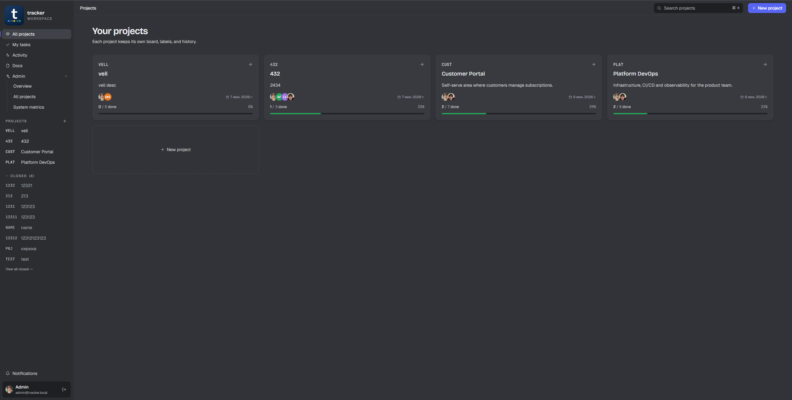
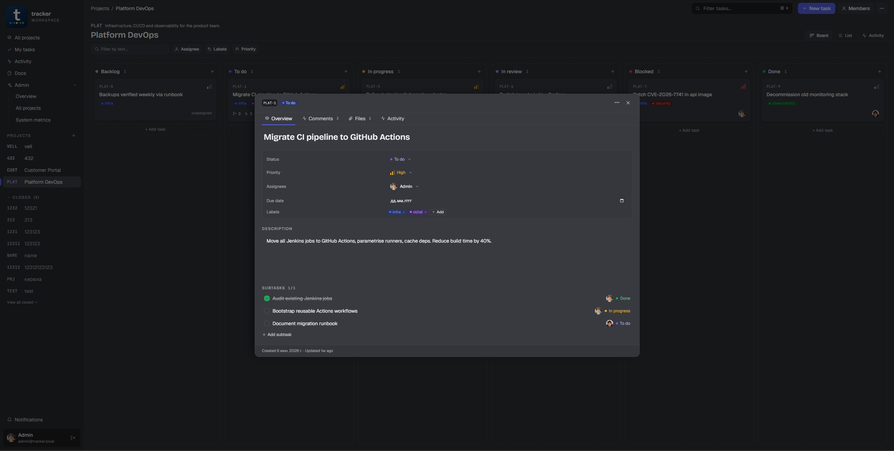
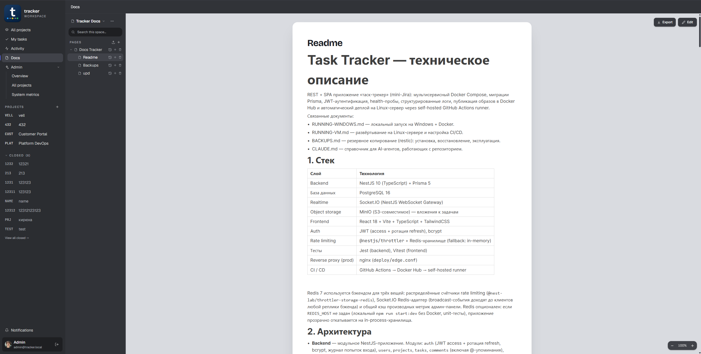
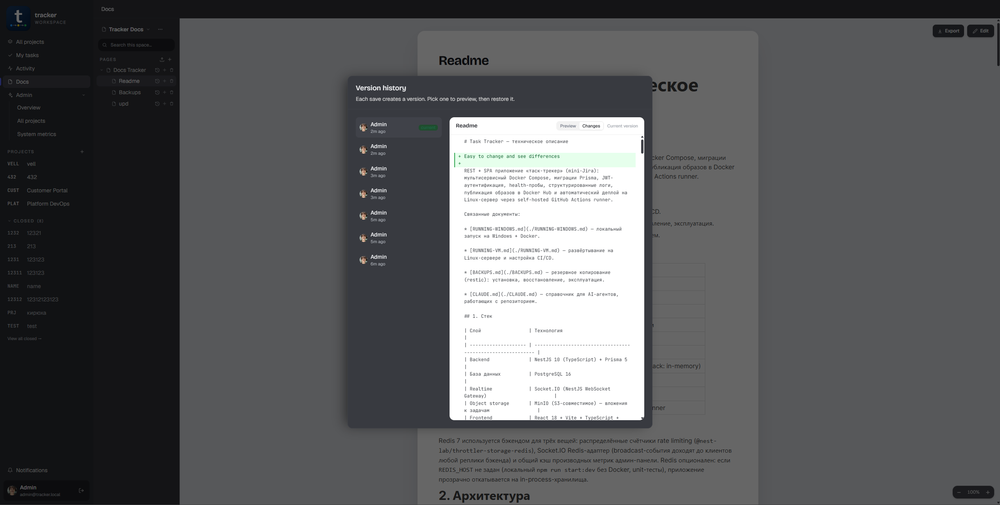
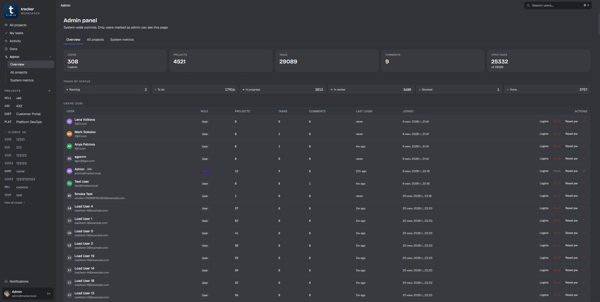
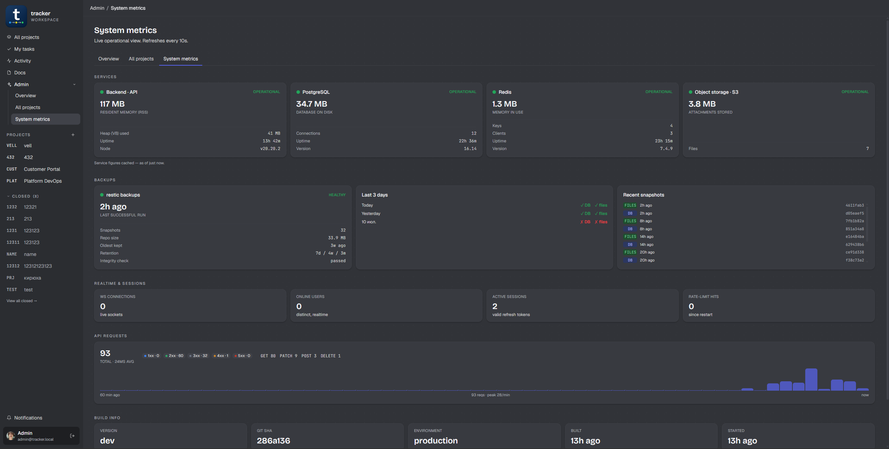

<p align="center">
  
</p>

<h1 align="center">Task Tracker</h1>
<p align="center">
  Мини-Jira с realtime-доской, вики и админкой — DevOps-стенд с полным CI/CD<br>
  на self-hosted GitHub Actions раннере.
</p>

<p align="center">
  
  
  
  
  
  
  <br>
  <a href="https://github.com/Vell401/DevOps-Web/actions/workflows/dev-cd.yml">
    
  </a>
</p>

<p align="center">
  🗂 Канбан-доска · 📝 Вики · 🔔 Realtime-уведомления · 👥 Роли и права · 📊 Admin-метрики · 🚀 CI/CD на self-hosted раннере
</p>

---

## Превью:
### Projects:

<p align="center">
  
</p>
<p align="center">
  
</p>

### Wiki:

<p align="center">
  
  
</p>

### Admin:

<p align="center">
  
  
</p>

Связанные документы:
- [RUNNING-WINDOWS.md](./RUNNING-WINDOWS.md) — локальный запуск на Windows + Docker.
- [RUNNING-VM.md](./RUNNING-VM.md) — развёртывание на Linux-сервере и настройка CI/CD.
- [BACKUPS.md](./BACKUPS.md) — резервное копирование (restic): установка, восстановление, эксплуатация.
- [CLAUDE.md](./CLAUDE.md) — справочник для AI-агентов.

---

## 1. Стек

| Слой | Технология |
|---|---|
| Backend | NestJS 10 (TypeScript) + Prisma 5 |
| База данных | PostgreSQL 16 |
| Realtime | Socket.IO (NestJS WebSocket Gateway) |
| Object storage | MinIO (S3-совместимое) — вложения к задачам |
| Frontend | React 18 + Vite + TypeScript + TailwindCSS |
| Auth | JWT (access + ротация refresh), bcrypt |
| Rate limiting | `@nestjs/throttler` + Redis-хранилище (fallback: in-memory) |
| Тесты | Jest (backend), Vitest (frontend) |
| Reverse proxy (prod) | nginx (`deploy/edge.conf`) |
| CI / CD | GitHub Actions → Docker Hub → self-hosted runner |

Redis 7 используется бэкендом для трёх вещей: распределённые счётчики rate
limiting (`@nest-lab/throttler-storage-redis`), Socket.IO Redis-адаптер
(broadcast-события доходят до клиентов любой реплики бэкенда) и общий кэш
производных метрик админ-панели. Redis опционален: если `REDIS_HOST` не задан
(локальный `npm run start:dev` без Docker, unit-тесты), приложение прозрачно
откатывается на in-process-хранилища.

---

## 2. Архитектура

- **Backend** — модульное NestJS-приложение. Модули: `auth` (JWT access +
  ротация refresh, bcrypt, журнал попыток входа), `users`, `projects`, `tasks`,
  `comments` (включая @-упоминания), `labels`, `activity`, `notifications`
  (инбокс упоминаний, прочитано/не прочитано), `docs` (вики: пространства,
  вложенные страницы, история версий, полнотекстовый поиск — независимая от
  проектов область со своими ролями), `admin`, `realtime` (WebSocket-шлюз),
  `storage` + `attachments` (загрузка файлов в S3/MinIO), `health`, `config`.
  Действует глобальный `ValidationPipe` (`whitelist` + `forbidNonWhitelisted` +
  `transform`), `helmet`, rate limiting (`@nestjs/throttler`) и структурированные
  JSON-логи (`nestjs-pino`) с redact'ом заголовков `Authorization` и `Cookie`.
  За обратным прокси выставлен `trust proxy`, чтобы счётчик лимитов работал по
  реальному IP клиента, а не по адресу edge-прокси.
- **Frontend** — SPA на React: аутентификация, список проектов, детальная
  страница проекта (Kanban-доска с drag-and-drop переупорядочиванием,
  комментарии с @-упоминаниями/редактированием/вложениями, активность,
  подзадачи, лейблы, множественные исполнители), управление участниками и ролями,
  страница «Мои задачи» (по всем проектам, дедлайн первым), инбокс уведомлений
  (упоминания/назначения/статусы/дедлайны, прочитано/не прочитано), фото профиля,
  закрытые проекты, дашборд активности с глобальным inbox, вики-раздел (Docs —
  вложенные страницы в блочном редакторе, поиск, история версий с восстановлением,
  доступ по приглашению), админ-панель (пользователи, весь список проектов в
  системе, per-service метрики). Axios-клиент с interceptor'ом, автоматически
  обновляющим access-токен по ответу 401. Обновления в реальном времени
  поступают по Socket.IO (`/api/socket.io`).
- **БД** — Prisma как source of truth (`backend/prisma/schema.prisma`). Сущности:
  `User`, `Project`, `ProjectMember` (роль участника), `Task`, `Label`,
  `Comment`, `Activity`, `Attachment`, `Notification`, `RefreshToken`,
  `LoginEvent` (журнал попыток входа для админки), `DocSpace`,
  `DocSpaceMember`, `DocPage`, `DocImage`, `DocPageRevision` (вики), а также
  связующие таблицы many-to-many (исполнители задач, лейблы задач).
- **Прод** — образы собираются в CI и публикуются в Docker Hub; на сервере их
  разворачивает `docker-compose.prod.yml` за edge-nginx (`deploy/edge.conf`),
  который дополнительно проксирует WebSocket-соединения.

### Модель доступа

- **Администратор** (`User.isAdmin`) — доступ к панели `/admin` (пользователи),
  `/admin/projects` (все проекты в системе, независимо от владельца) и
  `/admin/metrics`.
- **Владелец проекта** (`Project.ownerId`) — всё, что может ADMIN, плюс
  удаление проекта. Владелец не является строкой участника.
- **Роли участников** (`ProjectMember.role`):
  - `VIEWER` — читает проект и комментирует (включая @-упоминания), но не
    меняет задачи и не загружает файлы;
  - `EDITOR` — роль по умолчанию: создаёт и редактирует задачи (все поля),
    управляет лейблами, загружает файлы;
  - `ADMIN` — дополнительно управляет участниками и ролями, переименовывает,
    закрывает/переоткрывает проект, удаляет задачи и модерирует комментарии.
- Назначение исполнителем не-участника **автоматически добавляет** его в
  проект с ролью `EDITOR`.

Закрытый проект (`Project.closedAt`) доступен только для чтения: любые изменения
отклоняются до его переоткрытия владельцем или ADMIN'ом.

### Роли в разделе Docs (вики)

Раздел Docs (`/docs`) — независимая от проектов область: пространство
(`DocSpace`) со своим владельцем и своим списком участников, доступ в проекты
на него не переносится и наоборот.

- **Владелец пространства** (`DocSpace.ownerId`) — управляет участниками и
  единственный, кто может удалить пространство.
- **Роли участников** (`DocSpaceMember.role`):
  - `READER` — читает страницы, ищет по пространству;
  - `WRITER` — дополнительно создаёт и редактирует страницы, грузит
    изображения, восстанавливает более раннюю версию страницы.
- Глобальный администратор (`User.isAdmin`) получает `WRITER` в любом
  пространстве по умолчанию — это осознанный доступ для модерации, а не
  побочный эффект.

Каждое сохранение содержимого страницы создаёт снимок в `DocPageRevision`;
хранится не более 50 последних версий на страницу, более старые вытесняются
автоматически. Перемещение страницы под другого родителя проверяется на
цикл: новый родитель не может оказаться потомком переносимой страницы.

### Структура репозитория

```
backend/                 NestJS API
  prisma/                схема, миграции, seed
  src/                   модули: auth, users, projects, tasks, comments,
                         labels, activity, notifications, docs, admin,
                         realtime, storage, attachments, health, config
  test/                  e2e-тесты
  Dockerfile             multi-stage, non-root, с HEALTHCHECK
frontend/                React SPA
  src/                   страницы, компоненты, API-клиент, auth-контекст
  nginx.conf             SPA-фолбэк + /healthz
  Dockerfile             multi-stage build → nginx
deploy/edge.conf         продовый reverse-proxy (HTTP + WebSocket upgrade)
docker-compose.yml       локальный dev-стек (сборка из исходников)
docker-compose.prod.yml  прод-стек (образы из Docker Hub)
Makefile                 частые операционные команды
.env.example             шаблон переменных окружения
.github/workflows/       ci.yml, dev-cd.yml, prod-cd.yml
```

---

## 3. Быстрый старт (локально)

Пароли seeded-учёток берутся из переменных окружения и не имеют значений по
умолчанию, поэтому передаются непосредственно в команду seed:

```bash
cp .env.example .env
docker compose up -d --build
docker compose exec backend npx prisma migrate deploy   # идемпотентно; миграции в репо
docker compose exec \
  -e SEED_ADMIN_PASSWORD="задать-длинный-пароль" \
  -e SEED_TEST_PASSWORD="задать-другой-пароль" \
  backend npm run prisma:seed
```

Адреса:
- Frontend — <http://localhost:5173>
- API — <http://localhost:3000/api>
- Swagger — <http://localhost:3000/api/docs>
- Health: `/api/health/live` (процесс), `/api/health/ready` (пинг БД)

Seed создаёт две учётные записи — `admin@tracker.local` и `test@tracker.local` —
с паролями из `SEED_ADMIN_PASSWORD` и `SEED_TEST_PASSWORD`. В прод-деплое эти
значения поступают из GitHub Secrets — см. [RUNNING-VM.md](./RUNNING-VM.md).

Подробная инструкция для Windows — в [RUNNING-WINDOWS.md](./RUNNING-WINDOWS.md).
Список операционных команд выводит `make help`.

### Цикл локальной разработки

Контейнер на проде является финальным артефактом сборки; редактируются же
исходники в этом репозитории (`frontend/src/`, `backend/src/`,
`backend/prisma/schema.prisma` и т.д.). Типовой цикл:

1. Правка исходного файла — например, добавление поля в
   `frontend/src/pages/ProjectsPage.tsx`.
2. Локальная проверка одним из способов:
   - **Hot-reload фронтенда** (быстрее, требуется только Node.js):
     ```bash
     cd frontend && npm install && npm run dev
     # http://localhost:5173 с мгновенной перезагрузкой при сохранении
     ```
     Бэкенд при этом поднимается параллельно (через docker-compose или
     отдельно).
   - **Полный стек через Docker** (медленнее, ближе к проду):
     ```bash
     docker compose up -d --build
     ```
3. Push в ветку `dev` — пайплайн `dev-cd.yml` автоматически выкатывает новую
   версию на dev-сервер; push в `main` аналогично запускает `prod-cd.yml`.

При изменении схемы БД (`backend/prisma/schema.prisma`) создаётся миграция:

```bash
cd backend
npx prisma migrate dev --name <короткое-описание>
# новый каталог в backend/prisma/migrations/ коммитится вместе с кодом
```

При следующем деплое workflow применяет миграцию командой
`prisma migrate deploy`.

### API endpoints

Интерактивный список с try-it-out доступен в **Swagger UI**:
- Локально: <http://localhost:3000/api/docs>
- На сервере: `http://<IP_сервера>/api/docs`

Краткая выжимка (все маршруты под префиксом `/api`):

| Метод | Путь | Назначение | Auth |
|---|---|---|---|
| POST | `/auth/register` | Регистрация | — |
| POST | `/auth/login` | Логин, выдача access + refresh | — |
| POST | `/auth/refresh` | Новый access по refresh | — |
| POST | `/auth/logout` | Отзыв refresh-токена | — |
| GET | `/auth/me` | Текущий пользователь (включая `isAdmin`) | Bearer |
| GET | `/users` | Список пользователей (для assignee-picker) | Bearer |
| GET | `/projects` | Доступные проекты + stats (поддерживает `?closed=true`) | Bearer |
| POST | `/projects` | Создать проект | Bearer |
| GET | `/projects/:id` | Получить проект (+ роль вызывающего `myRole`) | Bearer (участник) |
| PATCH | `/projects/:id` | Переименовать / изменить описание | Bearer (ADMIN+) |
| DELETE | `/projects/:id` | Удалить проект | Bearer (владелец) |
| POST | `/projects/:id/close`, `/projects/:id/reopen` | Закрыть / переоткрыть проект | Bearer (ADMIN+) |
| GET, POST | `/projects/:id/members` | Участники: список / добавить (по умолчанию EDITOR) | Bearer (POST — ADMIN+) |
| PATCH | `/projects/:id/members/:memberId` | Сменить роль участника | Bearer (ADMIN+) |
| DELETE | `/projects/:id/members/:memberId` | Удалить участника | Bearer (ADMIN+) |
| GET | `/projects/:projectId/activity` | Лента активности проекта (пагинация) | Bearer (участник) |
| GET | `/projects/:projectId/activity/stats` | Агрегаты для дашборда | Bearer (участник) |
| GET, POST | `/projects/:projectId/tasks` | Список (пагинация) / создать задачу | Bearer (POST — EDITOR+) |
| GET | `/tasks/mine` | Мои открытые задачи по всем проектам (дедлайн первым) | Bearer |
| GET | `/tasks/:id` | Получить задачу | Bearer (участник) |
| PATCH | `/tasks/:id` | Изменить задачу (статус/поля) | Bearer (EDITOR+) |
| DELETE | `/tasks/:id` | Удалить задачу | Bearer (ADMIN+) |
| GET | `/tasks/:id/activity` | История изменений задачи | Bearer (участник) |
| GET, POST | `/tasks/:taskId/comments` | Список / добавить комментарий (@-упоминания, вложения) | Bearer (участник) |
| PATCH | `/comments/:id` | Редактировать комментарий | Bearer (только автор) |
| DELETE | `/comments/:id` | Удалить комментарий | Bearer (автор или ADMIN+) |
| GET, POST | `/tasks/:taskId/attachments` | Вложения задачи: список / загрузить (multipart) | Bearer (POST — EDITOR+) |
| GET | `/attachments/:id` | Получить/скачать файл вложения | Bearer (участник) |
| DELETE | `/attachments/:id` | Удалить вложение | Bearer (загрузивший или ADMIN+) |
| GET, POST | `/projects/:projectId/labels` | Лейблы проекта: список / создать | Bearer (POST — EDITOR+) |
| PATCH, DELETE | `/labels/:id` | Изменить / удалить лейбл | Bearer (EDITOR+) |
| GET | `/activity` | Глобальная лента активности (inbox, пагинация) | Bearer |
| POST, DELETE | `/users/me/avatar` | Загрузить / удалить фото профиля | Bearer |
| GET | `/users/:id/avatar` | Фото профиля пользователя | Bearer |
| GET | `/notifications` | Уведомления (упоминания, назначения, статусы, дедлайны) | Bearer |
| GET | `/notifications/unread-count` | Число непрочитанных уведомлений | Bearer |
| POST | `/notifications/read`, `/notifications/read-all` | Отметить прочитанными | Bearer |
| GET, POST | `/docs/spaces` | Пространства вики: список / создать (создатель — владелец) | Bearer |
| GET | `/docs/spaces/:id` | Пространство: заголовок + дерево страниц | Bearer (READER+) |
| PATCH | `/docs/spaces/:id` | Переименовать пространство / сменить иконку | Bearer (WRITER+) |
| DELETE | `/docs/spaces/:id` | Удалить пространство (каскадом — страницы и изображения) | Bearer (владелец) |
| GET | `/docs/spaces/:id/search` | Полнотекстовый поиск по заголовкам и содержимому | Bearer (READER+) |
| GET | `/docs/spaces/:id/members` | Участники пространства: список | Bearer (READER+) |
| POST | `/docs/spaces/:id/members` | Пригласить участника | Bearer (владелец) |
| PATCH, DELETE | `/docs/spaces/:id/members/:memberId` | Сменить роль участника / удалить | Bearer (владелец) |
| POST | `/docs/spaces/:id/pages` | Создать страницу в пространстве | Bearer (WRITER+) |
| GET | `/docs/pages/:id` | Страница целиком (контент) | Bearer (READER+) |
| PATCH, DELETE | `/docs/pages/:id` | Изменить (заголовок, контент, родитель) / удалить | Bearer (WRITER+) |
| GET | `/docs/pages/:id/revisions` | История версий страницы (до 50 записей) | Bearer (READER+) |
| GET | `/docs/revisions/:id` | Снимок конкретной версии | Bearer (READER+) |
| POST | `/docs/pages/:id/revisions/:revId/restore` | Откатить страницу к более ранней версии | Bearer (WRITER+) |
| POST | `/docs/pages/:id/images` | Загрузить изображение в текст страницы (multipart, до 10 МБ) | Bearer (WRITER+) |
| GET | `/docs/images/:id` | Получить байты изображения (авторизованный прокси) | Bearer (READER+) |
| GET | `/admin/stats` | Статистика для админ-дашборда | Bearer + Admin |
| GET | `/admin/projects` | Все проекты в системе, независимо от владельца (пагинация) | Bearer + Admin |
| GET | `/admin/metrics` | Per-service метрики (Postgres/Redis/S3/backend) | Bearer + Admin |
| GET | `/admin/users` | Расширенный список пользователей | Bearer + Admin |
| GET | `/admin/users/:id/logins` | История входов пользователя | Bearer + Admin |
| PATCH | `/admin/users/:id` | Изменить name / isAdmin / blocked / пароль | Bearer + Admin |
| DELETE | `/admin/users/:id` | Удалить пользователя | Bearer + Admin |
| GET | `/health/live` | Жив ли процесс | — |
| GET | `/health/ready` | Готовность (пинг БД) | — |

`Bearer` — заголовок `Authorization: Bearer <access_token>`, выдаваемый
`/auth/login`. Дополнительно бэкенд принимает WebSocket-подключения на
`/api/socket.io` с передачей токена в `auth.token` рукопожатия.

---

## 4. Переменные окружения

Объявлены в `.env.example` (корень, используется Compose) и
`backend/.env.example` (для запуска бэкенда вне контейнеров).

| Переменная | Где | Default | Назначение |
|---|---|---|---|
| `POSTGRES_USER` / `POSTGRES_PASSWORD` / `POSTGRES_DB` | compose | tracker | Инициализация Postgres |
| `DATABASE_URL` | backend | (из значений выше) | Строка подключения Prisma |
| `DB_CONNECTION_LIMIT` | compose | 10 | Размер пула соединений Prisma (дописывается в `DATABASE_URL`). Prisma по умолчанию = cpu*2+1 (~5 на 2 ядрах, виден на графике admin «Server sessions»); поднять до ~10–15 на нагруженной VM |
| `REDIS_HOST` / `REDIS_PORT` | backend | redis / 6379 | Параметры Redis (rate limiting, Socket.IO адаптер, кэш метрик). Если `REDIS_HOST` не задан — fallback на in-process-хранилища |
| `JWT_ACCESS_SECRET` / `JWT_REFRESH_SECRET` | backend | **обязательно сменить в prod** | Ключи подписи JWT |
| `JWT_ACCESS_TTL` / `JWT_REFRESH_TTL` | backend | 15m / 7d | Время жизни токенов |
| `THROTTLE_TTL` / `THROTTLE_LIMIT` | backend | 60 / 120 | Окно (сек) и квота rate-limit |
| `THROTTLE_AUTH_TTL` / `THROTTLE_AUTH_LIMIT` | backend | 60 / 10 | Отдельный, более строгий лимит для auth-роутов (login/register/refresh), на IP. Поднимать только для нагрузочного теста, затем вернуть |
| `CORS_ORIGINS` | backend | http://localhost:5173 | Разрешённые origins (через запятую) |
| `LOG_LEVEL` | backend | info | Уровень логирования Pino |
| `S3_ENDPOINT` / `S3_REGION` / `S3_BUCKET` | backend | minio / us-east-1 / tracker-attachments | Параметры объектного хранилища (MinIO в Docker) |
| `S3_ACCESS_KEY` / `S3_SECRET_KEY` | backend / minio | minioadmin (dev) | Ключи S3; в prod из секретов, ими же инициализируется MinIO |
| `MAX_UPLOAD_BYTES` | backend | 26214400 (25 МБ) | Максимальный размер загружаемого файла |
| `SLOW_QUERY_MS` | backend | 300 | Порог (мс), выше которого Prisma-запрос попадает в лог медленных запросов на `/admin/metrics` |
| `METRICS_CACHE_TTL_MS` | backend | 30000 | TTL кэша агрегатов админ-метрик (Postgres/Redis/S3-размеры); общий на все реплики через Redis |
| `BACKUP_STATUS_FILE` | backend | /backup-status.json | Путь к `status.json` бэкап-джоба restic внутри контейнера (в проде — read-only bind mount с хоста); карточка «Backups» на `/admin/metrics`. См. [BACKUPS.md](./BACKUPS.md) |
| `APP_VERSION` / `GIT_SHA` / `BUILD_TIME` | build arg | dev / unknown / unknown | Метаданные сборки для панели «Build info» в `/admin/metrics`; в проде подставляются CI как `--build-arg` при сборке образа |
| `SEED_ADMIN_PASSWORD` / `SEED_TEST_PASSWORD` | seed | — (обязательны) | Пароли seeded-учёток; без них seed завершается с ошибкой |
| `VITE_API_URL` | frontend build arg | http://localhost:3000/api | Зашивается в бандл при сборке. Для прод-образа задаётся как GitHub repo variable и подставляется build-job'ом workflow |
| `DOCKERHUB_USERNAME` | prod compose | — | Namespace образов в Docker Hub (совпадает с одноимённым secret) |
| `IMAGE_TAG` | prod compose | — | Тег разворачиваемого образа; CI выставляет `sha-<short>` |

Генерация прод-секретов: `openssl rand -base64 48`.

---

## 5. База данных и миграции

Prisma — source of truth, схема в `backend/prisma/schema.prisma`. Миграции
закоммичены в `backend/prisma/migrations/`, поэтому стенд поднимается без ручной
генерации.

| Действие | Команда |
|---|---|
| Применить миграции (любая среда) | `make migrate` (`prisma migrate deploy`) |
| Создать новую миграцию (dev) | `make migrate-dev` (`prisma migrate dev --name <x>`) |
| Загрузить seed | `make seed` (требует `SEED_*` переменных) |
| Открыть `psql` | `make shell-db` |

В деплое миграции применяются автоматически — шаг `Run database migrations`
выполняет `prisma migrate deploy` в одноразовом контейнере **до** запуска
основного стека приложения.

---

## 6. CI/CD

Используются две ветки развёртывания:

```
PR в main/dev   → ci.yml      (lint + тесты на ubuntu-latest)
push в dev      → dev-cd.yml  (test → build → deploy на self-hosted runner "dev")
push в main     → prod-cd.yml (test → build → deploy на self-hosted runner "prod")
```

Сборка образов выполняется на GitHub-hosted `ubuntu-latest`, а деплой — на
self-hosted runner'е, размещённом на целевом сервере. Такое разделение
обусловлено публичностью репозитория: на runner попадает только шаг деплоя
(`docker pull` + `docker compose up`), что минимизирует поверхность атаки. Образы
публикуются в Docker Hub с тегами `sha-<short>` (неизменяемый) и `dev`/`prod`
(подвижный указатель среды); тег `latest` сознательно не публикуется. После
сборки каждый образ проходит Trivy-скан: исправимые CRITICAL-уязвимости
блокируют пайплайн.

Каждый пайплайн поддерживает ручной запуск (`workflow_dispatch`) с параметром
`image_tag` — для отката на ранее собранный образ без пересборки.

### GitHub Secrets

| Secret | Значение |
|---|---|
| `DOCKERHUB_USERNAME` | логин Docker Hub |
| `DOCKERHUB_TOKEN` | access-token Docker Hub (не пароль) |
| `POSTGRES_PASSWORD` | пароль БД |
| `JWT_ACCESS_SECRET` | случайная строка (~64 байта) |
| `JWT_REFRESH_SECRET` | случайная строка (~64 байта) |
| `CORS_ORIGINS` | список разрешённых origins через запятую |
| `SEED_ADMIN_PASSWORD` | пароль seeded-админа |
| `SEED_TEST_PASSWORD` | пароль seeded-тестового пользователя |
| `S3_ACCESS_KEY` | ключ доступа MinIO/S3 (и root-пользователь MinIO) |
| `S3_SECRET_KEY` | секретный ключ MinIO/S3 (и root-пароль MinIO) |

### GitHub Variables (опционально)

| Variable | Default | Значение |
|---|---|---|
| `DEPLOY_DIR` | `/opt/tracker` | каталог деплоя на сервере |
| `VITE_API_URL` | `/api` | URL API, зашиваемый в прод-бандл фронтенда |

Подробный порядок настройки сервера, runner'ов и секретов приведён в
[RUNNING-VM.md](./RUNNING-VM.md).

---

## 7. Продакшн-развёртывание

Прод-стек (`docker-compose.prod.yml`) разворачивается на Linux-сервере, на
котором установлен self-hosted GitHub Actions runner. Деплой выполняется
автоматически при push в соответствующую ветку (`dev` или `main`); первичная
настройка сервера, пользователя `deploy`, runner'а, секретов и сетевого доступа
полностью описана в [RUNNING-VM.md](./RUNNING-VM.md).

**TLS.** Сервис `edge` отдаёт plain HTTP, что приемлемо для LAN-стенда. При
публикации в интернет перед edge ставится терминатор TLS — Caddy (авто-HTTPS),
Traefik или Let's Encrypt + certbot.

---

## 8. Observability

Стенд намеренно минимален — внешний стек наблюдаемости подключается под
конкретную среду.

- **Логи:** Pino → stdout (JSON); `redact` удаляет заголовки `Authorization` и
  `Cookie`. Сбор — Loki / ELK / Vector на выбор.
- **Health-пробы:** `/api/health/live` (процесс жив) и `/api/health/ready`
  (БД доступна) — подключаются в мониторинг аптайма.
- **Встроенный дашборд метрик:** `/admin/metrics` (только для админов) —
  per-service карточки со статусом, аптаймом и размерами: backend (RSS/heap,
  Node, аптайм), PostgreSQL (размер БД на диске, подключения, версия), Redis
  (память, ключи, клиенты), объектное хранилище S3 (объём вложений, файлы), а
  также HTTP-метрики, медленные запросы и срабатывания rate-limit. Данные
  собираются самим приложением и кэшируются (общий кэш через Redis); Docker-сокет
  не используется.
- **Статус бэкапов:** на том же `/admin/metrics` — карточка restic (последний
  прогон, успешные бэкапы за 3 дня, глубина хранения, `check`), читается из
  `status.json`, который пишет хостовый бэкап-джоб (см. [BACKUPS.md](./BACKUPS.md)).
- **Prometheus `/metrics`:** наружу пока не экспонируется — при необходимости
  добавляется `@willsoto/nestjs-prometheus` за внутренним ACL.
- **Tracing:** при необходимости — OpenTelemetry SDK в `main.ts` с
  OTLP-экспортом.

---

## 9. Шпаргалка команд

```bash
make up              # запустить стек
make migrate         # применить миграции
make seed            # загрузить демо-данные (нужны SEED_* переменные)
make logs            # просмотр логов
make shell-backend   # шелл в backend-контейнере
make shell-db        # psql в postgres
make test-backend    # юнит-тесты backend
make down            # остановить

# Прод (на сервере)
make prod-pull       # подтянуть образы
make prod-migrate    # применить миграции
make prod-up         # развернуть
make prod-logs       # логи прода
```
